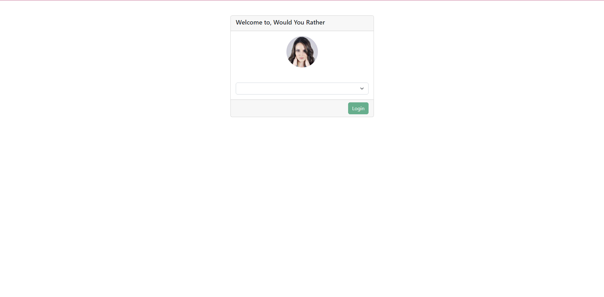
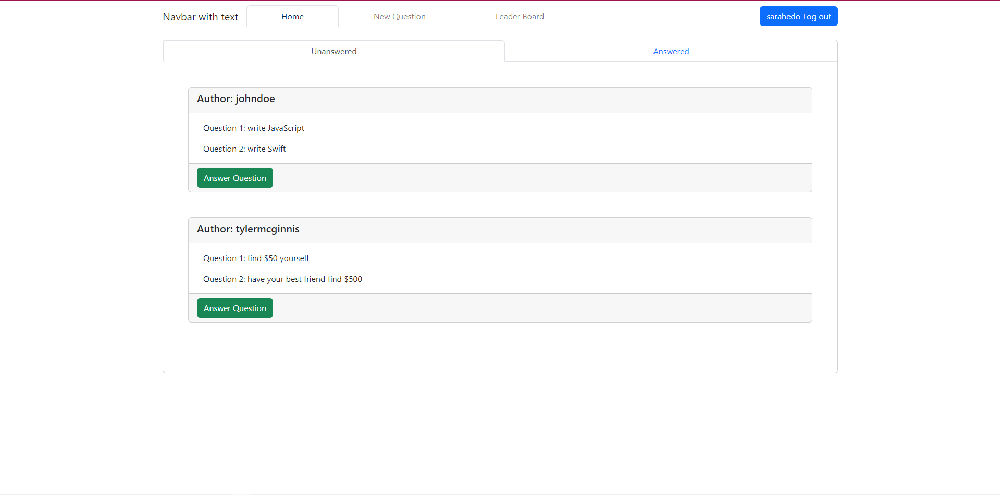
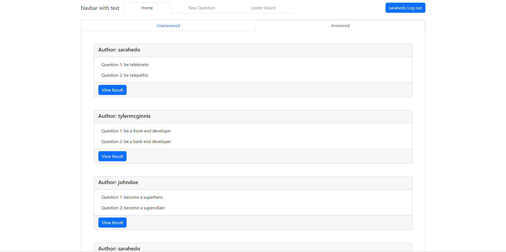
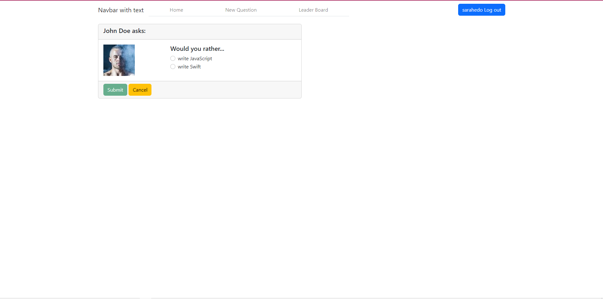
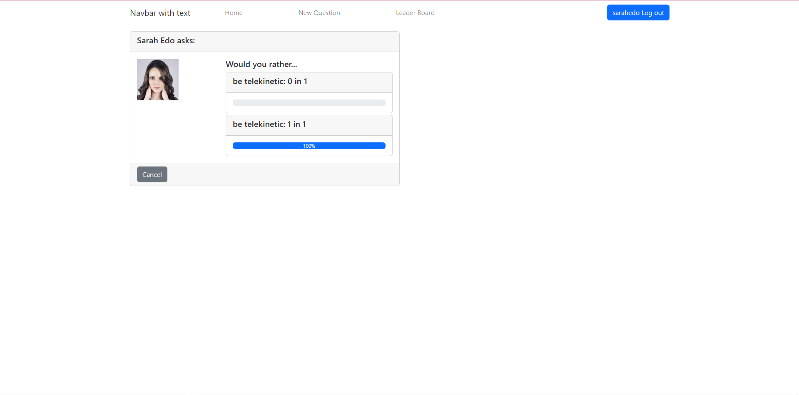
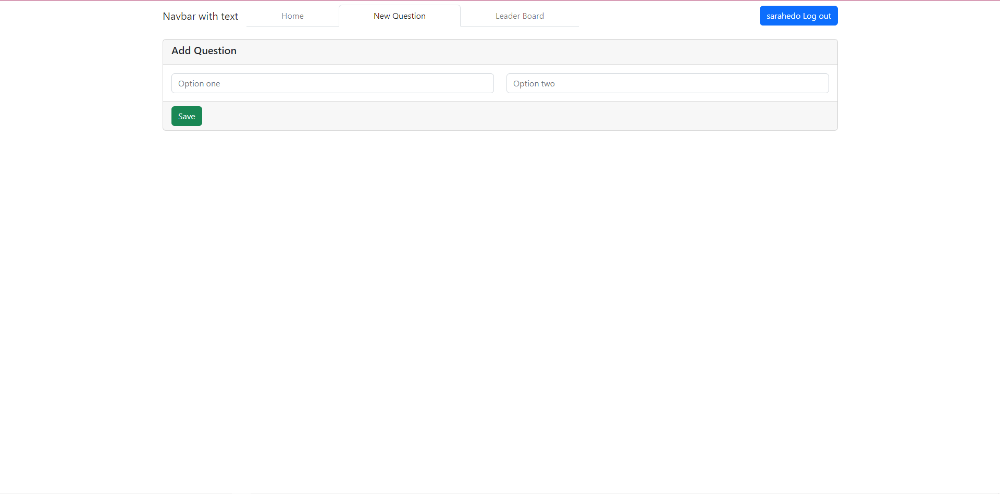
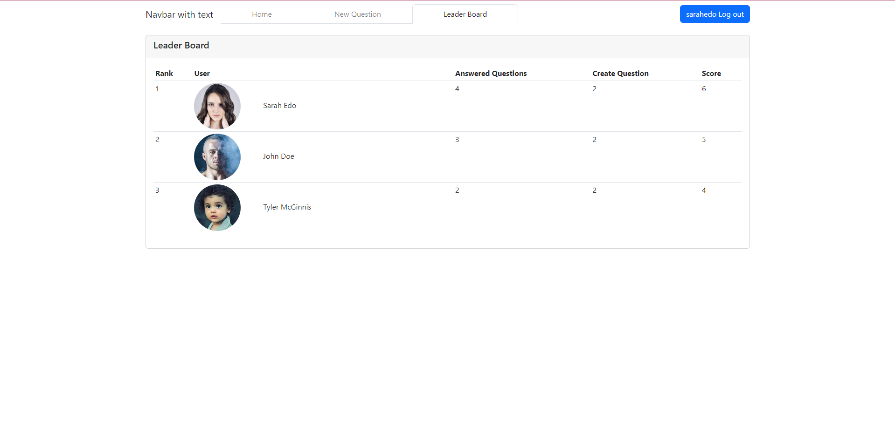

# KhoaDD6 React Project 2

## Description
> React Project 2

### Login Page

When you access the website, you must choose 1 account to login

### Home Page

After login successfully, you will be redirected to Home page.

Tag Unanswered contains questions not answered

When you click tag Answered, it contains questions answered

### Answer The Question

On Unanswered Tag of Home Page, you can click the Answer Question of any questions to answer this question

You must choose an option to submit

### View Result

On Unanswered Tag of Home Page, you can click the View Result of any questions to view result this question

### New Question

When you click New Question on navigation, you will see page to add a new question.

If any option is not filled, Save button is disabled 

### Leader Board

When you click Leader Board on navigation, you will see a ranking

## Clone Project
> `git clone https://github.com/dinhdangkhoa0201/khoadd6-react-project2.git`

> `cd khoadd6-react-project2`

## Install
> `npm install`

## Start Server
> `npm start`
